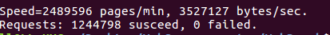
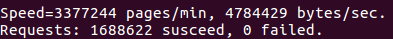
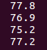
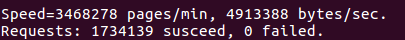
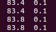
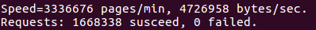
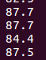
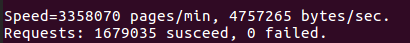
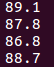

#测试目的
1.在相同环境下，和muduo提供的echo server进行测试，比较QPS;
2.通过开启不同线程池大小，比较各个情况下的QPS，选择最优的线程数量。

#测试环境
Intel(R) Core(TM) i5-7300HQ CPU @ 2.50GHz 4核4线程

#测试方法
1.使用Webbench工具，开启1000客户端进程，持续时间为60s；
2.设置读回调，做一个echo server，关闭不必要的输出；
3.双方线程池均开启4线程。
4.分别开启2线程、4线程、6线程和8线程，比较不同情况下的QPS以及CPU占用率。

#测试结果
##1.与muduo的QPS测试结果对比
muduoQPS:

rookieQPS:

结果表明，rookie的QPS会高于muduo，可能有以下原因：
①rookie没有使用应用层缓冲区，直接通过栈上数组接收数据后立刻发回，而muduo则是使用了vector<char>作为应用层缓冲区，这可能是其中一个原因；
②rookie采用的是非阻塞accept来循环接收连接，而muduo则是一次只接收一个连接。在压测情况下，突发大量连接，此时循环accept来接收显然会比一次一次的accept更好。不过对于较少连接的话，非阻塞accept必须多调用一次accept返回-1才能判断此时没有连接，而muduo的方式是等到epoll通知时再去接收一次连接，因此会少调用一次accept。

##2.不同线程下QPS以及CPU负载对比
2线程：

4线程：

6线程：

8线程：

对比可知，在4个线程的情况下，CPU使用率较高，并且QPS也是最高的。

