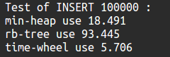
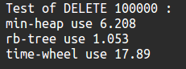
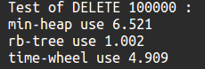

#三种定时器的效率对比

## 测试目的
目前最常见的定时器实现方式主要有以下几种：
1.红黑树实现(如Nginx、muduo);
2.最小堆实现(如libevent)；
3.时间轮实现(如netty)

测试主要目的是结合定时器的使用方式，分别对这三种实现方式进行插入和删除，比较操作所耗费的时间。

##测试对象
1.红黑树方面，为了从元素个数上保持一致，使用可插入重复元素的multiset而不是set;
2.最小堆方面，使用priority_queue；
3.时间轮方面，由于没有现成的容器，所以使用自己写的一个时间轮进行测试。(原理类似哈希表)

##测试方法
#### 1.插入测试
   插入10万个0~100000的随机数，比较其时间开销。
   
   测试代码如下：
   ```cpp
std::priority_queue<int>heap;
std::multiset<int>rb;
TimerWheel tw;

srand(time(NULL));

/***************最小堆测试*******************/
auto t1 = std::chrono::system_clock::now();
for(int i = 1; i<= 100000; i++)
{
        heap.push(rand()%100000);
}
auto t2 = std::chrono::system_clock::now();
auto duration = std::chrono::duration_cast<std::chrono::microseconds>(t2 - t1).count();
std::cout << "min-heap use "<<duration * 1e-3<<std::endl;
/**************红黑树测试********************/
t1 = std::chrono::system_clock::now();
for(int i = 1; i<= 100000; i++)
{
        rb.insert(rand()%100000);
}
t2 = std::chrono::system_clock::now();
duration = std::chrono::duration_cast<std::chrono::microseconds>(t2 - t1).count();
std::cout << "rb-tree use "<<duration * 1e-3<<std::endl;
/**************时间轮测试********************/
t1 = std::chrono::system_clock::now();
for(int i = 1; i<= 100000; i++)
{
        tw.add_timer(rand()%100000);
}
t2 = std::chrono::system_clock::now();
duration = std::chrono::duration_cast<std::chrono::microseconds>(t2 - t1).count();
std::cout << "time-wheel use "<<duration * 1e-3<<std::endl;
```
#### 删除测试
对于定时器来说，最频繁的操作就是从定时器中取出最小的那个结点并删除它。
为了保证三种方法的一致性，~先向三种容器中放入1～10000的元素，分别用来表示第1个到第10000个超时的元素。
然后从小到大依次删除所有结点，比较耗时。
当删除元素时：
对于最小堆来说，只需要pop即可；
对于红黑树来说，就是删除最小值；
对于时间轮来说，由于时间轮没有最小值的概念，它是模拟时钟每经过一次tick就走一步，然后每走一步都将对应的超时元素全部删除，所以在时间轮方面，只需要不停让时间轮tick，直到整个时间轮为空。

测试代码如下：
```cpp
std::priority_queue<int>heap;
    std::multiset<int>rb;
    TimerWheel tw;

    for(int i = 1; i<= 10000; i++)
    {
        heap.push(i);
    }
    for(int i = 1; i<= 10000; i++)
    {
        rb.insert(i);
    }
    for(int i = 1; i<= 10000; i++)
    {
        tw.add_timer(i);
    }

    srand(time(NULL));
    std::cout<<"Test of DELETE 100000 : "<<std::endl;
    auto t1 = std::chrono::system_clock::now();
    for(int i = 1; i< 10000; i++)
    {
        heap.pop();
    }
    auto t2 = std::chrono::system_clock::now();
    auto duration = std::chrono::duration_cast<std::chrono::microseconds>(t2 - t1).count();
    std::cout << "min-heap use "<<duration * 1e-3<<std::endl;


    t1 = std::chrono::system_clock::now();
    for(int i = 0; i< 10000; i++)
    {
        rb.erase(rb.begin());
    }
    t2 = std::chrono::system_clock::now();
    duration = std::chrono::duration_cast<std::chrono::microseconds>(t2 - t1).count();
    std::cout << "rb-tree use "<<duration * 1e-3<<std::endl;


    t1 = std::chrono::system_clock::now();
    while(tw.cnt)
    {
        tw.tick();
    }
    t2 = std::chrono::system_clock::now();
    duration = std::chrono::duration_cast<std::chrono::microseconds>(t2 - t1).count();
    std::cout << "time-wheel use "<<duration * 1e-3<<std::endl;
```
##测试结果对比及分析

###插入对比



分析：
最小堆的插入时间复杂度稳定在O(logN)；
红黑树由于不是严格平衡，所以插入时间复杂度最差可达到(2logN)并且还有一些旋转操作，导致插入表现稍微差了一些；
时间轮是基于哈希表原理的，因此插入的时间复杂度比较低，为O(1)。
基于以上分析以及测试结果，在插入性能方面，时间轮>最小堆>红黑树。

###删除对比



分析：
这是在时间轮的槽个数为60的情况的测试结果。红黑树>最小堆>时间轮。
最小堆的删除实际上就是删除堆顶的元素，但是删除后还需要进行调整，所以总体时间复杂度为O(logN)；
红黑树由于本身有序，并且可以通过迭代器直接找到最小值，然后再进行删除，根据STL，这个操作的时间复杂度是常数级别；
时间轮由于是基于哈希表，所以元素的散列程度显然会影响删除性能（插入时是头插法所以散列程度不会对插入性能造成影响），这是因为：每次tick时间轮都会走一步，因此每个槽都至少要走一遍，如果哈希冲突比较严重，那么就相当于会在一个结点上停留；而如果没有哈希冲突，就相当于时间轮只需要跟着tick走就可以了，所以显然散列程度越好，时间轮的删除性能越好。
下面增加时间轮的槽数，也就相当于进行了哈希表扩容，再测试一下性能：

N=100



可以看到，此时依然是红黑树的性能最好，但是时间轮的删除性能已经超过了最小堆。
再增加时间轮的槽数到1000，再测试一下性能：


可以看到，由于此时时间轮的散列程度较好，时间轮只需要一直tick即可，在这种情况下时间轮>红黑树>最小堆。


##总结

综上所述，在随机数插入的性能方面，时间轮>最小堆>红黑树；
在定时器超时删除的性能方面，红黑树>最小堆。时间轮主要收到散列程度的影响，散列程度越好，时间轮的性能越好，不过这样一来，占用的内存也会变大。

此外，在插入方面，测试了一下数据有序的情况下，最小堆的表现会优于红黑树，而最优的依然是时间轮。

最小堆最大的缺点在于，内部是以数组为底层实现的，因此有连续空间的分配要求。

当定时器中元素数量少，且分布基本有序的情况下，最小堆相比于红黑树是比较好的选择，这种情况下如果考虑占用内存大小，那么最小堆还比时间轮更好一些；
但是如果定时器中元素数量多，并且无法保证有序，那么就更应该从时间轮和红黑树中进行选择，而时间轮要想有好的性能必须散列程度足够好，即以空间换取时间。

